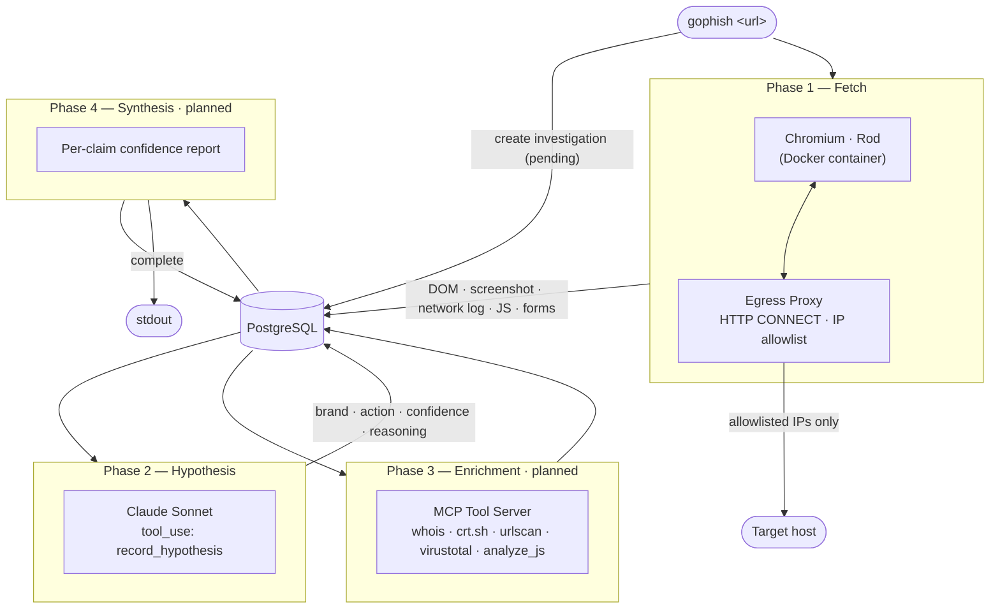
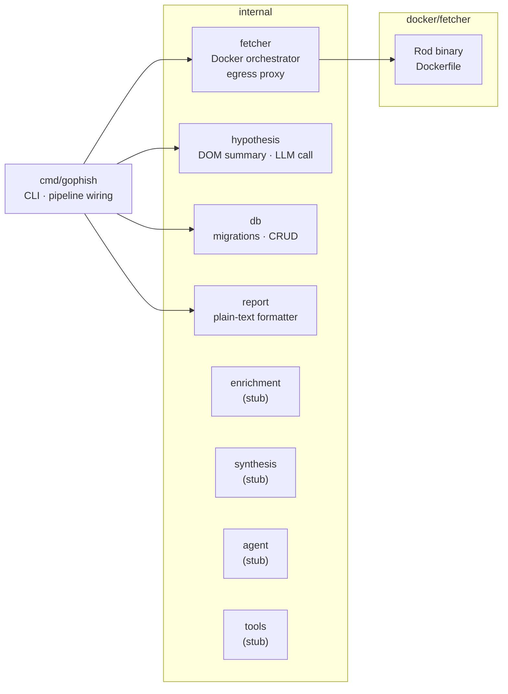

# Architecture

`go-phish` takes a suspicious URL and produces a structured phishing investigation report: brand impersonated, kit mechanics, credential exfiltration destination, and a verdict with per-claim confidence scores.

The pipeline has four phases. Each phase writes its output to Postgres before the next one starts, so a failure mid-run leaves a full audit trail and every investigation is replayable. Phases 1–2 are built; Phases 3–4 are planned.

## Pipeline

### Phase 1 — Fetch

The target URL is loaded inside a sandboxed Docker container running Chromium via [Rod](https://go-rod.github.io). An in-process HTTP CONNECT proxy (`internal/fetcher/proxy.go`) runs on the host and is the container's only egress path; it allows connections only to the IPs resolved for the target hostname at startup. QUIC and DNS-over-HTTPS are disabled in Chromium to prevent proxy bypass.

Captured artifacts: rendered DOM, full-page screenshot, network request log, all JS files, all forms with action URLs, and the final URL after any redirect chain.

See [`docs/egress-proxy.md`](egress-proxy.md) for full proxy topology and bypass mitigations.

### Phase 2 — Hypothesis

The screenshot and a structured DOM summary are sent to Claude Sonnet via the Anthropic API using `tool_use`. The model is forced to call `record_hypothesis`, which returns a structured object: `brand`, `targeted_action` (`credential_theft` | `payment_capture` | `mfa_bypass` | `other`), `confidence` (`low` | `medium` | `high`), and `reasoning`.

This is a single-turn call — no agent loop yet. The result is stored in the `hypothesis` JSONB column.

### Phase 3 — Enrichment *(planned)*

An agentic loop gives the model access to an MCP tool server and lets it decide what to investigate and in what order. Planned tools: `whois_lookup`, `cert_transparency`, `urlscan_lookup`, `virustotal_lookup`, `urlhaus_check`, `compare_to_brand_login`, `analyze_js`, `analyze_form`.

The loop runs until the model signals it is done or a cap is reached.

### Phase 4 — Synthesis *(planned)*

The model receives the hypothesis, all enrichment results, and produces a final report with **per-claim confidence levels** — not a single global score. This is where hallucinations surface: when the model says "high confidence," the eval harness checks whether it was right.

## Package structure

## Status

| Phase | Description | Status |
|---|---|---|
| 1 | Containerised fetch with egress restriction | ✅ Built |
| 2 | LLM hypothesis via `record_hypothesis` tool | ✅ Built |
| 3 | Enrichment agent loop (MCP tool server) | 🔲 Planned |
| 4 | Synthesis with per-claim confidence | 🔲 Planned |
