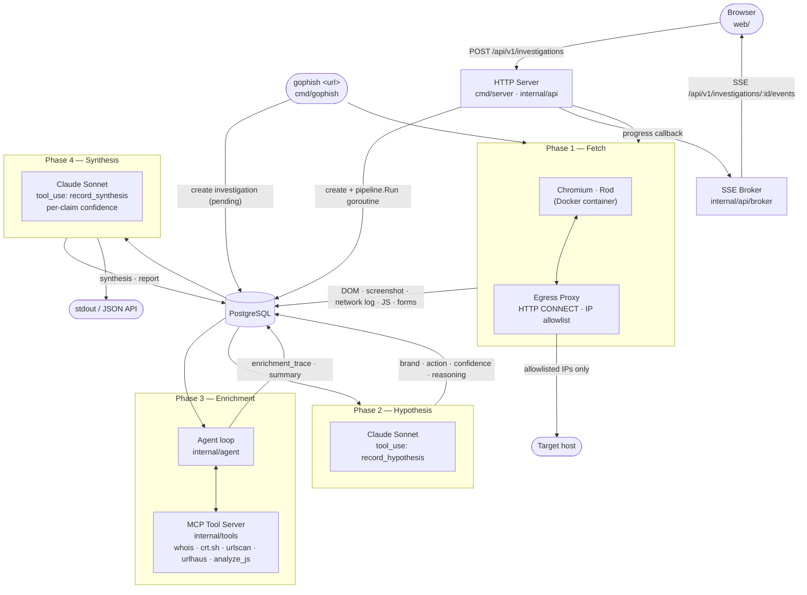

# Architecture

`go-phish` takes a suspicious URL and produces a structured phishing investigation report: brand impersonated, kit mechanics, credential exfiltration destination, and a verdict with per-claim confidence scores.

The pipeline has four phases. Each phase writes its output to Postgres before the next one starts, so a failure mid-run leaves a full audit trail and every investigation is replayable. All four phases are built.

## Pipeline

Two entry points trigger the same four-phase pipeline: the CLI (`cmd/gophish`) and the HTTP server (`cmd/server`). The HTTP server also fans progress events to connected browsers via SSE.

### Phase 1 — Fetch

The target URL is loaded inside a sandboxed Docker container running Chromium via [Rod](https://go-rod.github.io). An in-process HTTP CONNECT proxy (`internal/fetcher/proxy.go`) runs on the host and is the container's only egress path; it allows connections only to the IPs resolved for the target hostname at startup. QUIC and DNS-over-HTTPS are disabled in Chromium to prevent proxy bypass.

Captured artifacts: rendered DOM, full-page screenshot, network request log, all JS files, all forms with action URLs, and the final URL after any redirect chain.

See [`docs/egress-proxy.md`](egress-proxy.md) for full proxy topology and bypass mitigations.

### Phase 2 — Hypothesis

The screenshot and a structured DOM summary are sent to Claude Sonnet via the Anthropic API using `tool_use`. The model is forced to call `record_hypothesis`, which returns a structured object: `brand`, `targeted_action` (`credential_theft` | `payment_capture` | `mfa_bypass` | `other`), `confidence` (`low` | `medium` | `high`), and `reasoning`.

This is a single-turn call — no agent loop yet. The result is stored in the `hypothesis` JSONB column.

### Phase 3 — Enrichment

An agentic loop (`internal/agent`) gives the model access to an in-process MCP tool server (`internal/tools`) and lets it decide what to investigate and in what order. The loop runs until the model responds with no tool calls or an iteration cap is reached (default 10, configurable via `ENRICHMENT_MAX_TURNS`). Every tool call and result is recorded in `enrichment_trace` and persisted before Phase 4 begins.

Tools: `whois_lookup`, `cert_transparency`, `urlscan_lookup`, `urlhaus_check`, `analyze_js`. The MCP server uses an in-process transport — no network socket, same binary.

### Phase 4 — Synthesis

A single LLM call receives the Phase 2 hypothesis, the full Phase 3 enrichment trace, and a Phase 1 artifact summary (final URL, form actions, JS file count — no raw DOM or screenshot). The model is forced to call `record_synthesis`, which returns five independently assessed claims: `brand_impersonated`, `kit_identification`, `exfil_target`, `infrastructure_notes`, and `verdict`. Each claim carries a `confidence` level (`low | medium | high`) and an `evidence` string that must cite a specific tool output or artifact observation by name. Vague reasoning without a source is rejected by the schema.

Per-claim confidences are the primary anti-hallucination mechanism: when the model says "high confidence," the eval harness checks whether it was right. A global confidence score is not produced.

## Package structure

```mermaid
graph LR
    cmd_cli["cmd/gophish\nCLI entry point"]
    cmd_server["cmd/server\nHTTP server entry point"]

    subgraph internal
        api["api\nHTTP handlers · SSE broker\nroutes · middleware"]
        pipeline["pipeline\nphase orchestration\nEvent type"]
        fetcher["fetcher\nDocker orchestrator\negress proxy"]
        hypothesis["hypothesis\nDOM summary · LLM call"]
        db["db\nmigrations · CRUD"]
        report["report\nplain-text formatter"]
        agent["agent\nagent loop · MCP dispatch"]
        tools["tools\nMCP server · tool handlers"]
        synthesis["synthesis\nLLM call · per-claim verdict"]
        telemetry["telemetry\ntracer.go — tracer init · shutdown · Version()\nattrs.go — gen_ai.* and ssspy.* attribute constants\npayload.go — Truncate() · 32 KB threshold"]
    end

    subgraph webpkg["web/"]
        webembed["React SPA\n(embedded dist/)"]
    end

    subgraph docker["docker/fetcher"]
        fetcherbin["Rod binary\nDockerfile"]
    end

    cmd_cli --> pipeline
    cmd_cli --> telemetry
    cmd_server --> api
    cmd_server --> telemetry
    api --> pipeline
    api --> db
    api --> webembed
    pipeline --> fetcher
    pipeline --> hypothesis
    pipeline --> agent
    pipeline --> synthesis
    pipeline --> db
    pipeline --> report
    pipeline --> telemetry
    agent --> tools
    agent --> telemetry
    hypothesis --> telemetry
    synthesis --> telemetry
    synthesis --> db
    fetcher --> fetcherbin
```

`internal/telemetry` owns tracer initialisation, shutdown, the `TracerName` constant, all `gen_ai.*` and `ssspy.*` attribute name constants (`attrs.go`), and the `Truncate` payload-size helper (`payload.go`). Span *creation* is distributed across the packages that own each operation — `cmd/gophish` creates the root investigation span, `internal/pipeline` creates phase spans, and `internal/hypothesis`, `internal/synthesis`, and `internal/agent` each create their own LLM call spans and (for agent) tool call spans. No span is created inside `internal/telemetry` itself.

## Status

| Component | Description | Status |
|---|---|---|
| Phase 1 | Containerised fetch with egress restriction | ✅ Built |
| Phase 2 | LLM hypothesis via `record_hypothesis` tool | ✅ Built |
| Phase 3 | Enrichment agent loop (MCP tool server) | ✅ Built |
| Phase 4 | Synthesis with per-claim confidence | ✅ Built |
| Web UI | React SPA · HTTP API · SSE live progress | ✅ Built |
