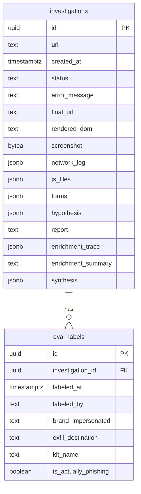
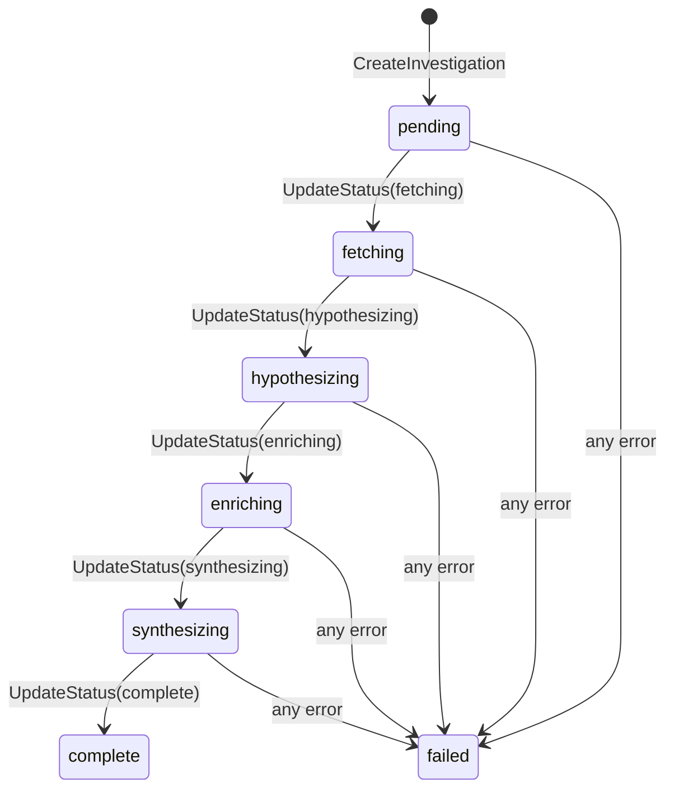

# Data Model

## Entity-Relationship Diagram

## Status transitions

## Column notes

### `investigations`

| Column | Phase | Notes |
|---|---|---|
| `status` | all | Enum-like: `pending` → `fetching` → `hypothesizing` → `enriching` → `synthesizing` → `complete` / `failed` |
| `network_log` | 1 | Array of `{url, method, status, content_type}` objects from Rod |
| `js_files` | 1 | Array of `{url, content}` objects for inline/external scripts |
| `forms` | 1 | Array of `{action, method, fields[]}` objects |
| `hypothesis` | 2 | `{brand, targeted_action, confidence, reasoning}` — LLM output |
| `enrichment_trace` | 3 | Ordered array of `{tool, input, output, called_at}` records from the agent loop |
| `enrichment_summary` | 3 | Final text response from the model when it signals completion |
| `synthesis` | 4 | Structured verdict: five claims (`brand_impersonated`, `kit_identification`, `exfil_target`, `infrastructure_notes`, `verdict`), each with `value`, `confidence`, and `evidence` fields |
| `report` | 4 | Final plain-text report printed to stdout — includes synthesis findings with per-claim confidence levels |

### `eval_labels`

Ground-truth labels applied by a human analyst after an investigation completes. Accumulate from the first investigation so the eval harness has data from day one.

| Column | Notes |
|---|---|
| `brand_impersonated` | Analyst-verified brand (may differ from LLM hypothesis) |
| `is_actually_phishing` | The primary eval signal |
| `exfil_destination` | Where credentials/data actually go (post-manual analysis) |
| `kit_name` | Known kit family if identified |
