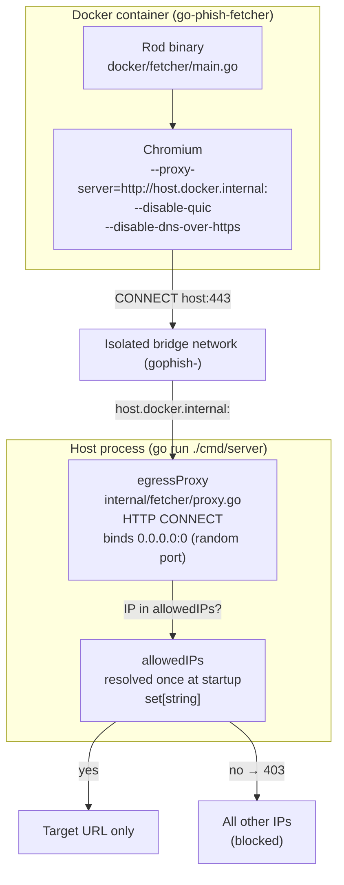
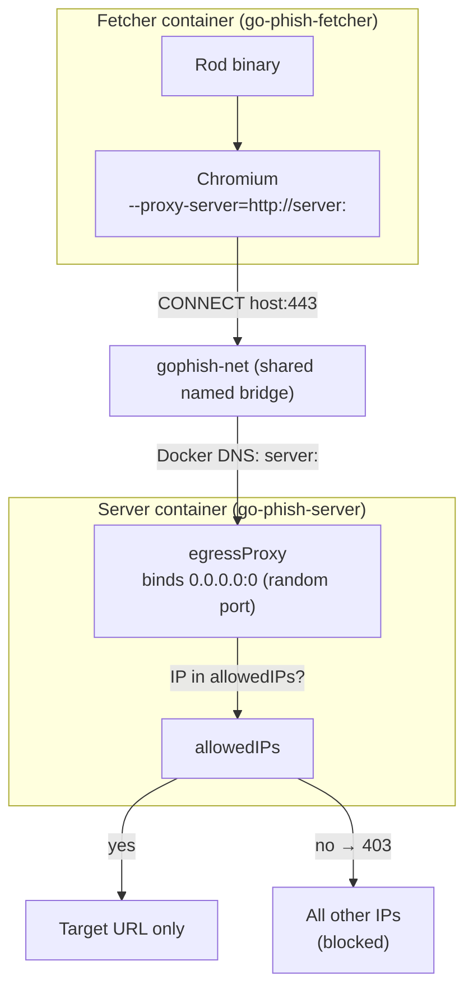
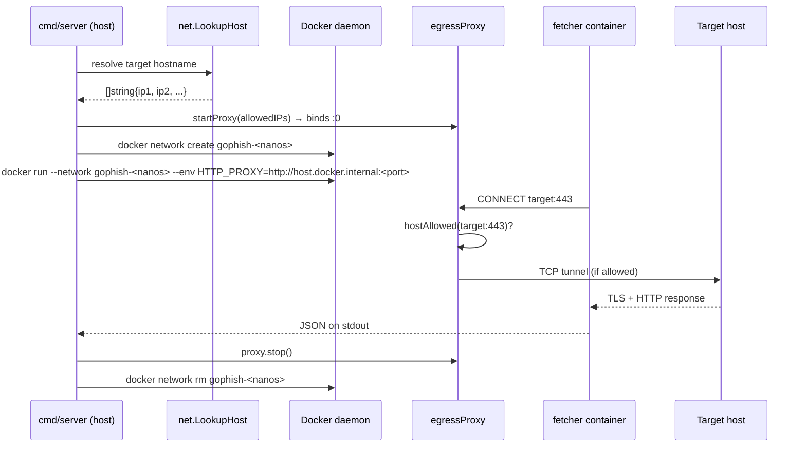
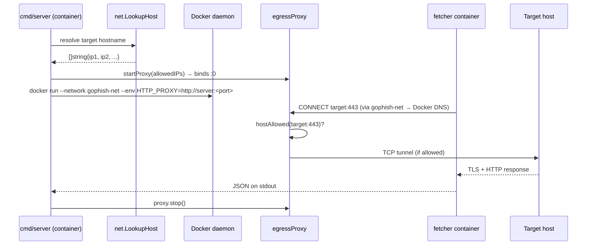

# Egress Proxy

## Why

The headless browser runs inside Docker and must reach the target URL — but we need to prevent it from reaching anything else (C2 callbacks, data exfiltration endpoints, analytics, CDN resources that obscure the real kit). A plain network allowlist isn't enough because Chromium can bypass per-destination rules via DNS-over-HTTPS or QUIC.

The solution is a per-investigation HTTP CONNECT proxy that runs in the server process, accepts only connections to the target's resolved IPs, and is the container's only egress path.

## Topology

Two deployment modes are supported. The proxy logic is identical in both; only the network path from the fetcher container to the proxy changes.

### Local development (server runs on host)



### Containerised (docker compose up)



The fetcher container is attached to `gophish-net` (set via `FETCHER_NETWORK=gophish-net`). The proxy is reachable at `server:<port>` via Docker DNS (set via `PROXY_HOST=server`). Postgres is on a separate network and is unreachable from fetcher containers.

## Per-investigation lifecycle

### Local development



### Containerised



## Proxy bypass vectors closed

| Vector | Mitigation |
|---|---|
| DNS-over-HTTPS (bypasses system resolver) | `--disable-dns-over-https` flag passed to Chromium |
| QUIC (UDP, bypasses TCP proxy) | `--disable-quic` flag passed to Chromium |
| Direct TCP to non-target IPs | HTTP CONNECT handler returns 403 for IPs not in the allow set |
| Container reaching host network | Isolated bridge network; only `host.docker.internal` is reachable |

## Linux vs macOS (local development only)

When the server runs on the host, the proxy address passed to fetcher containers depends on the OS:

| Platform | `host.docker.internal` | `--add-host` needed? |
|---|---|---|
| macOS / Windows | Injected automatically by Docker Desktop | No |
| Linux | Not injected | Yes — `--add-host=host.docker.internal:host-gateway` |

In containerised mode (`FETCHER_NETWORK` is set) neither applies — Docker DNS resolves the service name directly and `--add-host` is skipped.

```go
// internal/fetcher/run.go
if fetcherNetwork == "" && runtime.GOOS == "linux" {
    args = append(args, "--add-host=host.docker.internal:host-gateway")
}
```

## Environment variables

| Variable | Default | Purpose |
|---|---|---|
| `PROXY_HOST` | `host.docker.internal` | Hostname fetcher containers use to reach the egress proxy |
| `FETCHER_NETWORK` | _(empty)_ | Pre-existing Docker network to attach fetchers to; when set, per-investigation networks are skipped |

Both are set automatically by `docker-compose.yml` when running with `docker compose up`.
