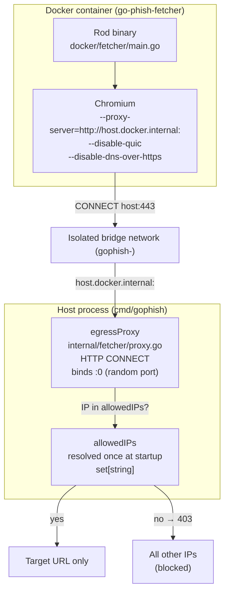
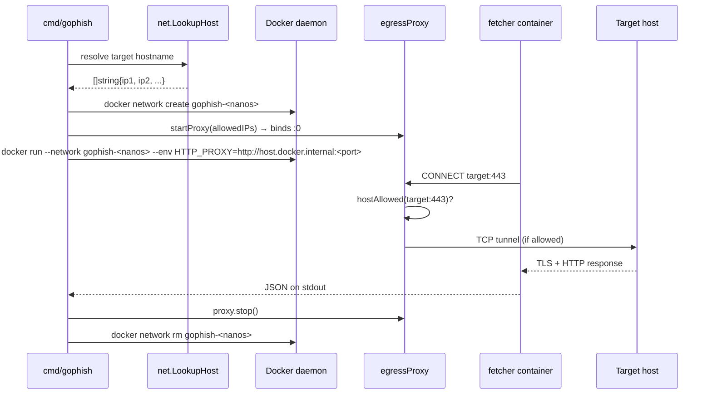

# Egress Proxy

## Why

The headless browser runs inside Docker and must reach the target URL — but we need to prevent it from reaching anything else (C2 callbacks, data exfiltration endpoints, analytics, CDN resources that obscure the real kit). A plain network allowlist isn't enough because Chromium can bypass per-destination rules via DNS-over-HTTPS or QUIC.

The solution is a per-investigation HTTP CONNECT proxy that runs in the host process, accepts only connections to the target's resolved IPs, and is the container's only egress path.

## Topology



## Per-investigation lifecycle



## Proxy bypass vectors closed

| Vector | Mitigation |
|---|---|
| DNS-over-HTTPS (bypasses system resolver) | `--disable-dns-over-https` flag passed to Chromium |
| QUIC (UDP, bypasses TCP proxy) | `--disable-quic` flag passed to Chromium |
| Direct TCP to non-target IPs | HTTP CONNECT handler returns 403 for IPs not in the allow set |
| Container reaching host network | Isolated bridge network; only `host.docker.internal` is reachable |

## Linux vs macOS

On macOS/Windows, Docker Desktop runs inside a Linux VM and injects `host.docker.internal` automatically — the container can always reach the host via this hostname.

On Linux, Docker does not inject `host.docker.internal`. We pass `--add-host=host.docker.internal:host-gateway` to `docker run` so the container resolves it to the host's gateway IP on the bridge.

```go
if runtime.GOOS == "linux" {
    args = append(args, "--add-host=host.docker.internal:host-gateway")
}
```
